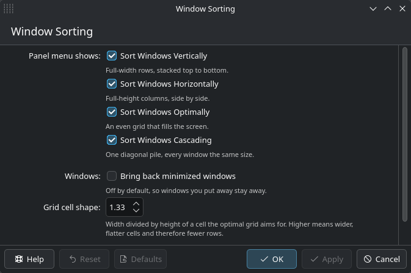

# plasma-window-sorter

Adds window-sorting entries to the KDE Plasma panel's right-click menu, right
next to *Show Panel Configuration*:

| Entry | Layout |
|---|---|
| **Sort Windows Vertically** | every window full width, stacked top to bottom, equal heights |
| **Sort Windows Horizontally** | every window full height, side by side, equal widths |
| **Sort Windows Optimally** | an even grid that fills the screen |
| **Sort Windows Cascading** | one diagonal pile, all windows the same size |

Only the windows on the screen whose panel you right-clicked are touched, and
only those on the current virtual desktop and activity. Windows are un-maximized
and un-fullscreened first, so the result is always the layout you asked for.

Works on Wayland and X11 (Plasma 6.7, tested on 6.7.4 / Arch).

## Install

```sh
./install.sh          # builds, backs up the stock panel, installs, restarts plasmashell
./uninstall.sh        # puts the distribution's panel back
```

`install.sh` asks for your sudo password, because the panel plugin is a system
file. Useful flags:

```
--include-minimized   also un-minimize and tile minimized windows (also in the settings page)
--debug               log every sort to the journal (journalctl --user -b | grep plasma-window-sorter)
--aspect 1.6          preferred cell shape for "Optimal" (default 1.3333 = 4:3)
--no-restart          leave plasmashell alone
--no-hook             skip the pacman upgrade warning hook
--offline             build from the vendored QML instead of downloading
```

## Settings

**System Settings → Window Management → Window Sorting** (or `kcmshell6
kcm_windowsorter`), installed alongside the panel:



Tick the entries you actually want in the panel menu — the others disappear
from it. With all four off the menu looks exactly as it did before. The page
also holds whether minimized windows get pulled back into the layout, the cell
shape the optimal grid aims for, and a logging switch.

Everything lives in `~/.config/plasma-window-sorterrc`, and the panel re-reads
it every time the menu opens, so nothing needs restarting either way:

```ini
[General]
ShowVertical=true
ShowHorizontal=true
ShowOptimal=true
ShowCascade=true
IncludeMinimized=false
TargetAspect=1.3333333
Debug=false
```

## From the shell

```sh
tools/sort.sh optimal            # vertical | horizontal | optimal | cascade
```

Bind it to a key in *System Settings → Keyboard → Shortcuts → Custom Shortcuts*
if you want shortcuts as well as menu entries.

## How it works

Plasma's panel menu is assembled by the `org.kde.contextmenu` containment-action
plugin. For a panel it emits, in order:

```
add widgets → _context → configure ("Show Panel Configuration") → remove
```

`_context` is `Containment::contextualActions()` — a virtual method. So this
project rebuilds the panel containment `org.kde.panel` from **upstream's own
QML**, unmodified, and swaps only the trivial generated plugin class for
`PanelSorter` (`src/panelsorter.cpp`), which overrides that one method. That is
why the entries appear exactly where *Show Panel Configuration* does, and why
nothing about the panel's look or behaviour changes.

Moving windows is KWin's job (on Wayland nothing else may), so triggering an
entry writes a parameterised copy of `kwin/sorter.js` into `$XDG_RUNTIME_DIR`,
loads it over KWin's scripting D-Bus interface, runs it and unloads it again.
The panel passes its own screen geometry along, which is how the sort knows
which output you meant.

```
panel right-click → PanelSorter::sortWindows(mode)
                  → $XDG_RUNTIME_DIR/plasma-window-sorter-<mode>-<ts>.js
                  → org.kde.KWin /Scripting loadScript + start
                  → kwin/sorter.js lays out the windows
```

## Layout rules

* **Vertical / Horizontal** — one row (or column) per window, sizes split evenly
  with rounding spread across the slices so no gaps appear at the edges.
* **Optimal** — the column count is chosen so the cells come closest to
  `TargetAspect`, with a small penalty for layouts that would leave holes; rows
  are then balanced (5 windows → 3 + 2), so the whole work area is used.
* **Cascade** — every window gets the same size, offset diagonally by ~3.5% of
  the screen; the pile restarts before it would run off the edge, and windows
  are raised in their existing stacking order, so whatever was on top stays on
  top.

The work area comes from KWin (`MaximizeArea`), so panels and other struts are
respected.

## Files

```
src/panelsorter.{h,cpp}   the containment subclass (the actual patch)
src/CMakeLists.txt        builds org.kde.panel.so from staged upstream QML + our class
src/kcm/                  System Settings module (KQuickConfigModule + QML)
  kcm.{h,cpp}             loads and saves the settings
  *.kcfg / *.kcfgc        the settings themselves, generated into C++
  ui/main.qml             the page you see in System Settings
kwin/sorter.js            the layout engine that runs inside KWin
upstream/<version>/       upstream panel QML, vendored as an offline fallback
tools/sort.sh             trigger a sort from the shell
doc/                      the images in this file
install.sh / uninstall.sh
```

`install.sh` puts two files in place: the replacement `org.kde.panel.so` and
`plasma/kcms/systemsettings/kcm_windowsorter.so` for the settings page.

`install.sh` downloads the panel QML matching your installed Plasma from
invent.kde.org, so a Plasma upgrade only needs a re-run, not a code change. If
the download fails it falls back to the vendored copy and warns.

## Caveats

* Upgrading `plasma-desktop` reinstalls the stock panel and silently removes the
  sorting entries. The pacman hook installed by `install.sh` prints a reminder;
  re-run `./install.sh` afterwards.
* `pacman -Qkk plasma-desktop` will report `org.kde.panel.so` as modified. That
  is expected — the original is kept at
  `/var/lib/plasma-window-sorter/org.kde.panel.so.orig`.
* If a build ever produces a panel that does not load, you get an empty desktop
  with no panel. Recover from a TTY or KRunner with:
  `~/Projects/plasma-window-sorter/uninstall.sh`
